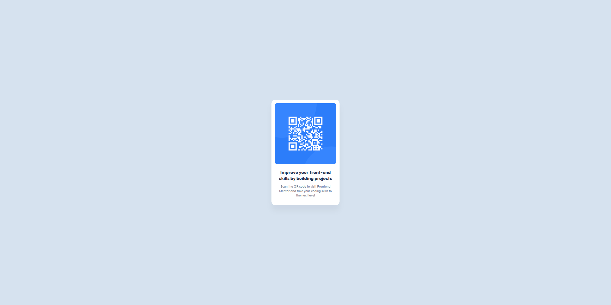

# Frontend Mentor - QR code component solution

This is a solution to the [QR code component challenge on Frontend Mentor](https://www.frontendmentor.io/challenges/qr-code-component-iux_sIO_H). Frontend Mentor challenges help you improve your coding skills by building realistic projects.

## Table of contents

- [Overview](#overview)
  - [Screenshot](#screenshot)
  - [Links](#links)
- [My process](#my-process)
  - [Built with](#built-with)
  - [What I learned](#what-i-learned)
  - [Continued development](#continued-development)
  - [Useful resources](#useful-resources)
- [Author](#author)
- [Acknowledgments](#acknowledgments)

## Overview

### Screenshot



### Links

- Solution URL: [GitHub Repository](https://github.com/AhmedMedhatFathy2008/QR-code-component)
- Live Site URL: _Not available yet_

## My process

### Built with

- Semantic HTML5 markup
- CSS custom properties
- Flexbox

### What I learned

This my first time I take Element from figma file and exterct it accursly
and It's my first time using letter-spacing and lnieheight with seeing this influnce

```css
main p {
  letter-spacing: 0.2px;
  line-height: 140%;
}
```

### Continued development

In future projects, I want to focus more on:

- Improving web accessibility (a11y) practices to make pages readable for all users.

### Useful resources

- [Elzero Web School](https://www.youtube.com/@ElzeroWebSchool) - Essential resource for mastering HTML & CSS fundamentals.
- [Ghareeb Elshaikh || غريب الشيخ](https://youtu.be/fDkR0TDR9dI) - Great tutorial that helped me finally understand Git and GitHub workflows clearly.

## Author

- Frontend Mentor - [@AhmedMedhatFathy2008](https://www.frontendmentor.io/profile/AhmedMedhatFathy2008)
- X (Twitter) - [@Ahmed_45_2008](https://x.com/Ahmed_45_2008)

## Acknowledgments

Thanks to my dad, my mom, and my family for encouraging me, and to my mentor, Osama Elzero, for the helpful courses!
